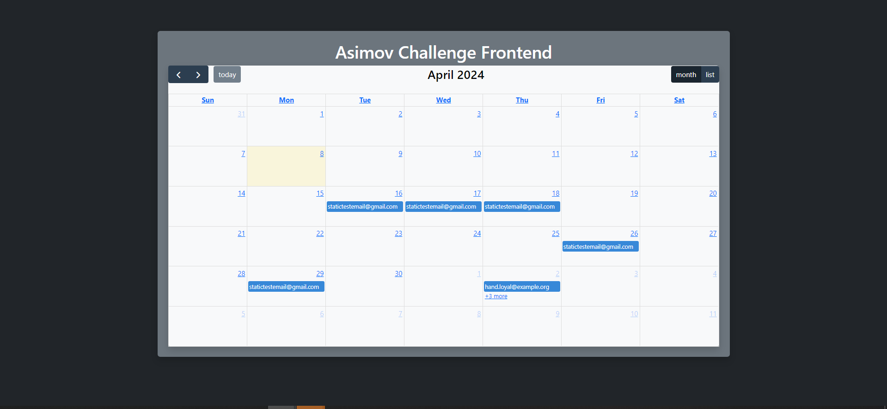
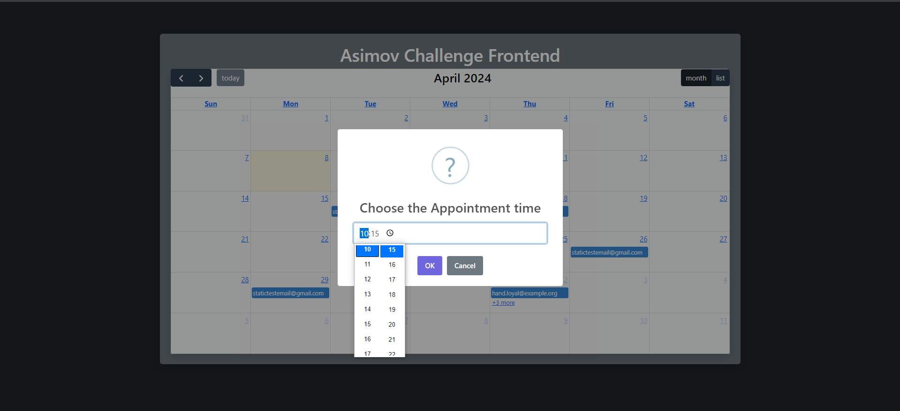
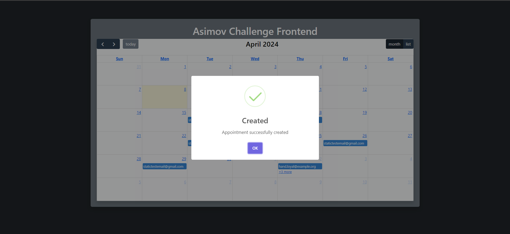
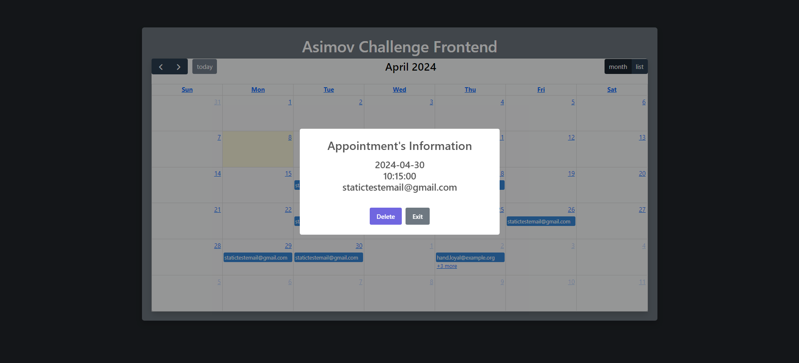
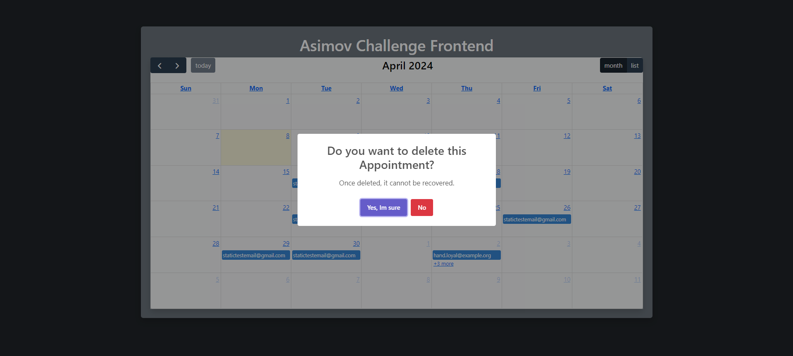
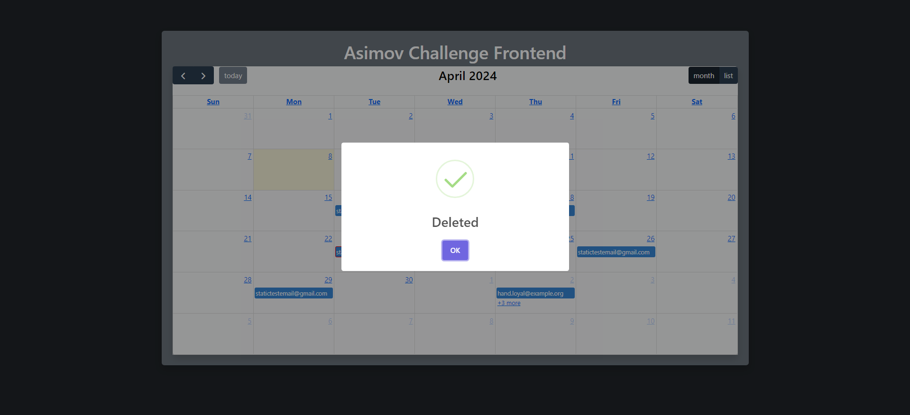
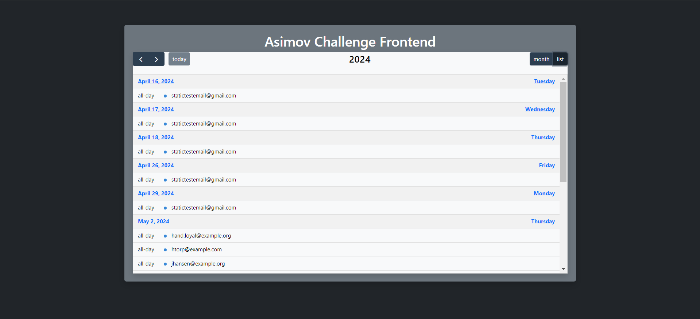

Esta es la parte 2 del reto, es la construcción de un Frontend de la API de la parte 1 siguiendo la especificacion JSON:API

### Recursos útiles

- [JSON API](https://jsonapi.org/) - Sitio web oficial de JSON API.
- [API DOCUMENTATION - POSTMAN](https://documenter.getpostman.com/view/20954385/2sA35K2g56#59f347bd-6633-4fc6-87dd-d20f3be11997) - Documentacion de la API en Postman.

